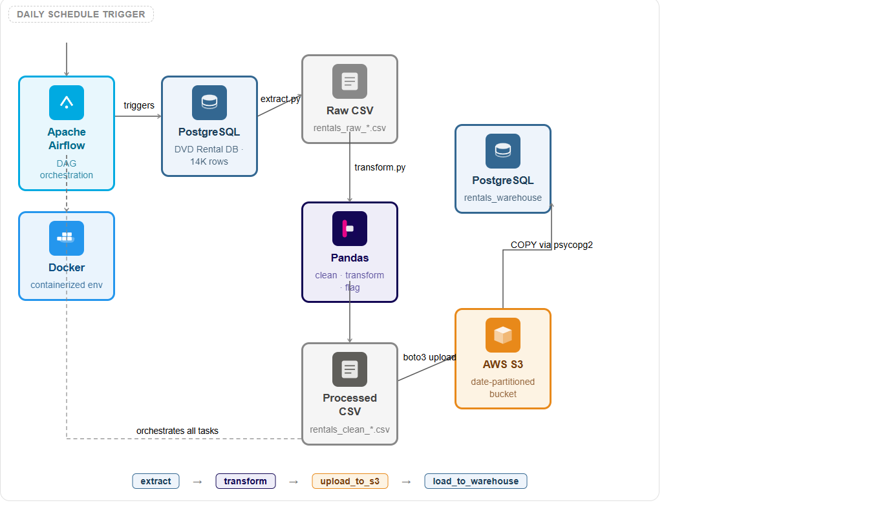

# DVD Rental ETL Pipeline (Airflow + S3 + PostgreSQL)

A daily ETL pipeline built on PostgreSQL's DVD rental dataset. Extracts rental and payment data, cleans and transforms it using Pandas, stages it in S3, and loads it into a PostgreSQL warehouse — all orchestrated with Apache Airflow running in Docker.

---

# 1.Tech Stack

 

- Source: PostgreSQL (DVD Rental DB)
- Transform: Python, Pandas
- Orchestration: Apache Airflow (Docker)
- Storage: AWS S3
- Warehouse: PostgreSQL (rentals_warehouse)

## 2.Architecture




# 3.Pipeline

extract → transform → upload → load_to_postgres

### Steps

- **Extract** → Joins 5 tables, pulls 14K+ rows to CSV  
- **Transform** → Cleans data, fixes types, flags late returns & unpaid rentals  
- **Upload** → Pushes cleaned CSV to S3 with date partitioning  
- **Load** → Downloads from S3, bulk loads via COPY into warehouse  

---

## 4.Data Insights

- 183 open rentals (null return_date)
- 24 zero-payment transactions
- Duplicate rental patterns due to multiple payments per rental


## 5.Setup
1.
```bash
git clone https://github.com/abinav-s/dvd-rental-pipeline.git
cd dvd-rental-pipeline
pip install -r requirements.txt
```
2.
Create .env:
```
DB_PASSWORD=your_postgres_password
```

3.
Start Airflow:
```bash
docker-compose up
```

Open `http://localhost:8080` → trigger `dvd_rental_pipeline`

---

## 6.Dag Output
